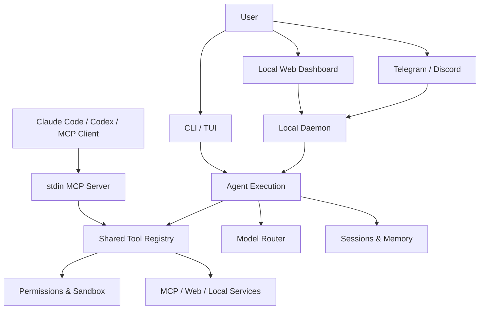
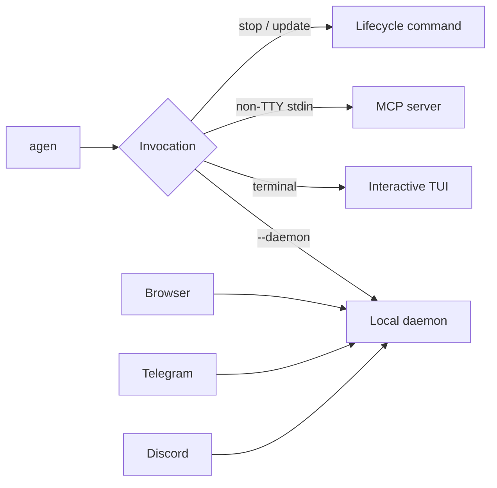
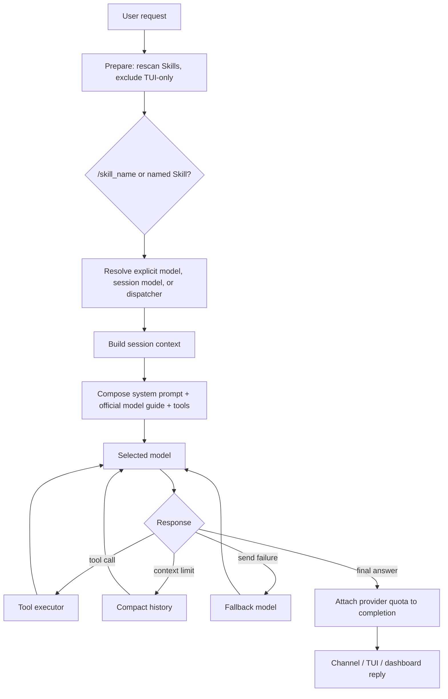
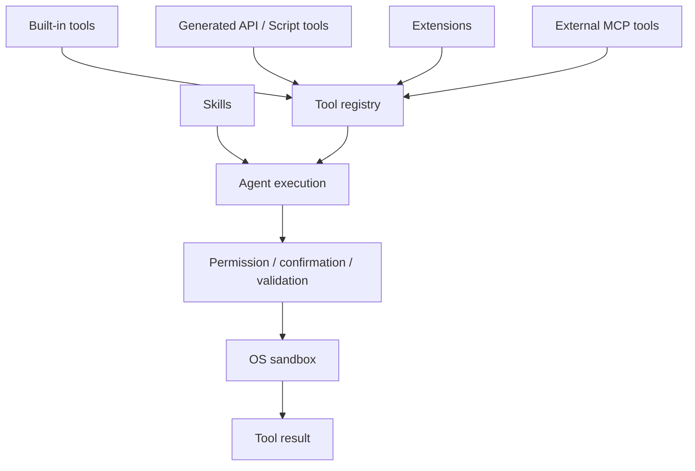
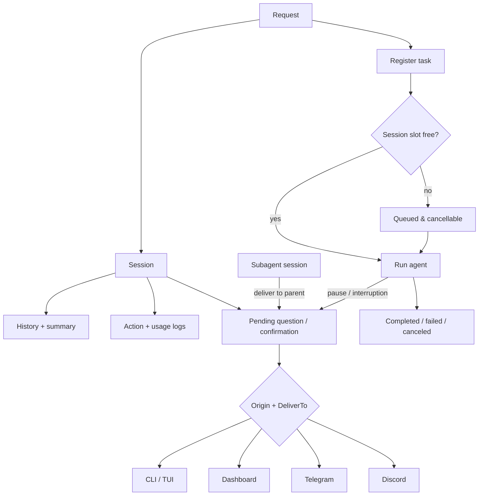
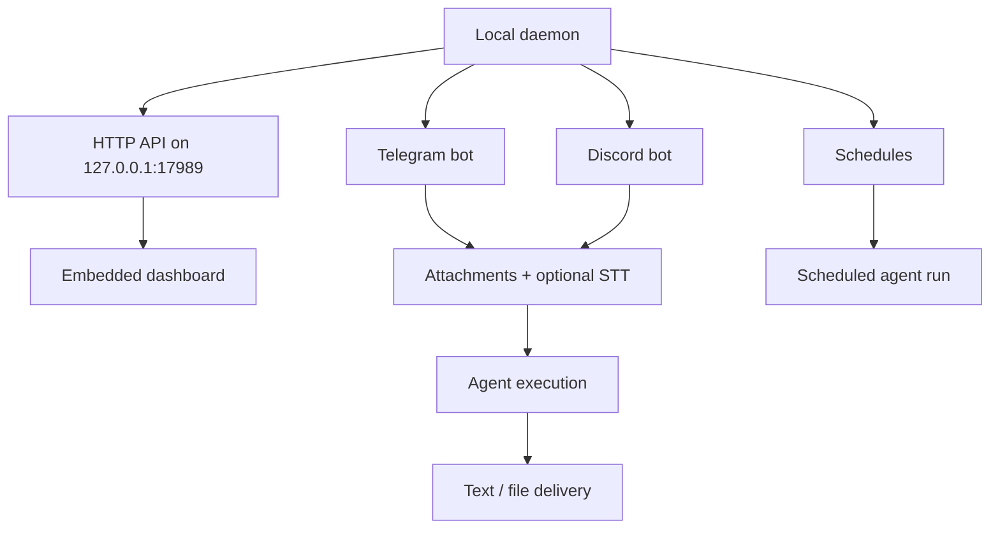
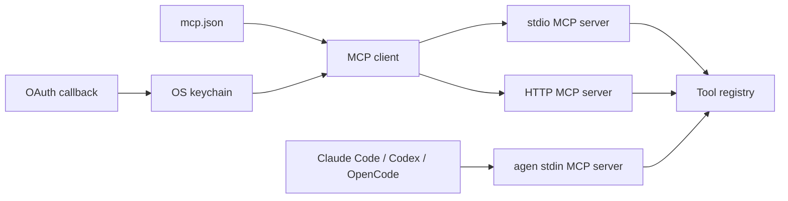
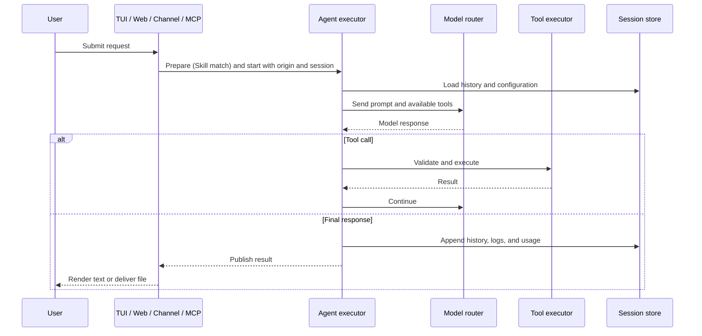
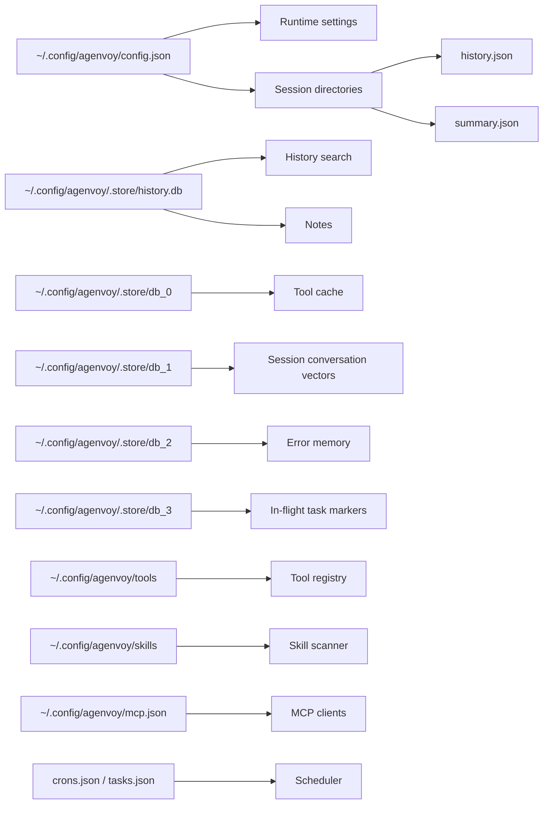

# Agenvoy - Architecture

> Back to [README](../README.md)

## Overview

Agenvoy is a local Go agent runtime. One execution engine powers the interactive TUI, browser dashboard, Telegram and Discord, and the stdin MCP server. It routes each request to a configured model, runs Skills and sandboxed tools, persists session history, notes, schedules, and usage locally, and can create tools when a capability is missing.

## Module: Entry Points

The `agen` binary opens the TUI by default. The local daemon serves the browser dashboard at `http://127.0.0.1:17989`; Telegram and Discord connect outward from that daemon, so no inbound port or public host is required. When stdin is not a terminal, `agen` serves local tools through newline-delimited JSON-RPC MCP instead of opening the TUI.

Every session-backed surface — TUI, dashboard `/send`, pending resume, Telegram, and Discord — enters execution through the same two steps: `exec.Prepare` rescans Skills, excludes TUI-only tools and Skills outside the TUI, and resolves a leading `/<skill_name>` or a named Skill; `exec.Start` then records the input, resolves the model, builds the session, and runs the agent. Entry points only handle their own transport, authorization, and rendering. Telegram and Discord share one reply pipeline for status updates, chunking, footers, error notices, and attachments. The TUI and the daemon both watch `config.json` and reload the model registry when it changes (the daemon also reconnects the chat bots), and the TUI subscribes to the daemon log so chat verification codes and host reloads appear in the terminal.

## Module: Agent Execution and Model Routing

The runtime matches a request to a Skill when applicable, then selects the configured primary model and fallbacks. A leading `/<skill_name>` is the only inline syntax; delegating to a named session goes through the `subagents` tool with a `self_id`. A model named explicitly by the caller (for example the `model` field of `/send`) is used as-is and fails when it is not registered; otherwise the session-bound model or the dispatcher decides. Completion events carry the remaining provider quota — a percentage for `codex`, `grok-oauth`, `copilot`, and `ollama-cloud`, a balance for `openrouter` and `deepseek` — fetched once before the event is delivered, so the TUI footer, dashboard badge, and chat footers all show the same value. Dispatcher, summary, image generation, speech-to-text (STT), and text-to-speech (TTS) are separate optional roles. Registered models keep a user-defined priority order that decides fallback, with `pass`-tier models always last. Each model can carry a tier (`S` `A` `B` `C` `pass`) in `model_tag`; the dispatcher orders tiers by the kind of work, defaulting to A, and when one model is registered under several providers it prefers `codex` / `grok-oauth`, then `copilot`, then the direct API, then `openrouter`. Subagent legs are sized by the same tiers according to their job. Local OpenAI-compatible endpoints are registered as `<name>@<model>`; custom endpoint URLs are kept under `compats` in `config.json`, while the Ollama and llama.cpp defaults that `/model add` detects on their usual ports are built in. History is compacted once it reaches 80% of the model's input window. Window sizes come from `llm-io.agenvoy.com`, refreshed at most hourly before a run and keyed by vendor and model (`nvidia` and `openrouter` models resolve through the vendor inside the model name); when a model is not listed, `copilot@` models assume 256K and everything else 128K. During prompt assembly it injects the common official operating guide plus any guide matching the selected model. The NVIDIA NIM `nvidia/nemotron-3.5-lightning-30b-a3b` model is documented as a free, non-large model for trying Agenvoy, not as a required dispatcher or primary model.

## Module: Tools, Skills, and Sandbox

Built-in tools, generated API/script tools, installed extensions, and MCP tools share one registry. Tools load their full schema only when needed to keep routine requests lightweight. Before execution, the executor checks denied and sensitive paths, command policy, confirmation requirements, argument validation, and the OS sandbox. A normal tool confirmation asks whether to allow that specific tool call. Restricted paths and package-management operations additionally require system verification where the channel supports it. Denied paths and configured denied commands are hard rejected; commands outside the denylist are not an allowlist failure, though they can still enter the normal confirmation flow. Long-form deliverables go through `write_report`, which writes to the configured output directory (`output_dir`; `~/Downloads` by default, or `~/.config/agenvoy/download` when that folder does not exist) rather than the work directory. Other files made for the user land there too unless the request names a location. `run_command` waits for the process to exit, so commands that start a file watcher (`--watch`, `chokidar`, or a package script that runs one, followed through `sh -c` and `package.json`) are refused before they run. File search is paged, and `read_files` returns 2048 lines by default with a notice naming the next offset. If live data needs a tool that does not exist, the agent can build, test, and retain a new tool.

## Module: Sessions, Memory, and Task Lifecycle

Every request belongs to a session. Session configuration is stored in SQLite; sessions retain messages, summaries, logs, usage, and pending questions. Active tasks publish short-lived `action:<session>:<task>` markers in ToriiDB and refresh them while running, so pending lists expose only tasks that can actually be resumed. Pending requests have two routing keys: `Origin` selects the listener (CLI/TUI, web, Telegram, or Discord), while `DeliverTo` selects the session window that receives the prompt and result. A subagent runs in its own session but inherits the parent origin and delivers confirmations and `ask_user` prompts back to the parent session. Tasks are registered before they compete for a per-session concurrency slot, so queued work remains visible and cancellable. A user cancel (TUI cancel or `ctrl+c`, **Abort task**, the cancel API) discards the task's pending entry; a pause or any other interruption stops the run but keeps the entry resumable.

## Module: Daemon, Dashboard, and Chat Channels

The daemon initializes ToriiDB before SQLite, clears stale in-flight markers, then opens the history database and migrates notes before starting the local HTTP server. It registers the web confirmation listener before serving the loopback API. Its dashboard is embedded in the binary and served by the same localhost-only daemon. The dashboard's System tab compares the running version with the latest GitHub release and can open a terminal running `agen update` (Terminal.app on macOS, `cmd.exe` into the WSL distro, or a Linux terminal emulator). Telegram and Discord require only their bot tokens because the daemon initiates the connection. Since **v0.34.4**, the default voice-input-to-voice-output loop is paused for those channels; STT/TTS tools can still generate audio files and send them through either channel.

## Module: MCP Client and Server

Agenvoy connects to external MCP servers over stdio or streamable HTTP, refreshes their tools when their catalog changes, and can complete OAuth sign-in while storing credentials in the operating-system keychain. In the other direction, running `agen` with non-terminal stdin exposes the same sandboxed local tools to Claude Code, Codex, OpenCode, and other MCP-compatible clients.

## Data Flow

## Security Boundaries

- The dashboard and management API bind to `127.0.0.1`; the host is not exposed for normal browser or chatbot use.
- Telegram and Discord use outbound connections from the local daemon and need only a bot token.
- Denied paths and denied commands are hard rejected. Sensitive paths, writes outside `$HOME`, and other restricted actions require explicit confirmation and, where supported, system verification; approval is scoped to the session and requested path or binary.
- Command execution is validated and sandboxed (`sandbox-exec` on macOS and `bwrap` on Linux). `sudo` is refused inside `run_command`; a command that writes outside `$HOME` declares those paths through `write_paths` on that call and is approved with the system password.
- Credentials, including provider and MCP OAuth tokens, are stored in the operating-system keychain rather than the repository.

## Persistence Layout

---

©️ 2026 [邱敬幃 Pardn Chiu](https://www.linkedin.com/in/pardnchiu)
