# Agenvoy - Architecture

> Back to [README](../README.md)

## Overview

Agenvoy is a local Go agent runtime that combines an interactive terminal interface, a local HTTP daemon, chatbot integrations, and MCP client/server capabilities. The runtime shares one execution engine for model routing, session-aware tools, skills, and persistent history.

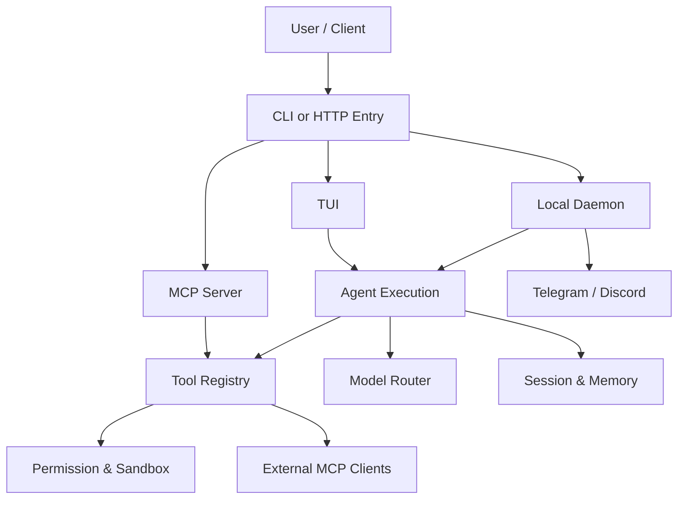

## Module: Entry Points

The `cmd/app` binary runs the TUI by default. `agen stop` stops the daemon, `agen update` runs the official updater, and non-terminal stdin activates the MCP server.

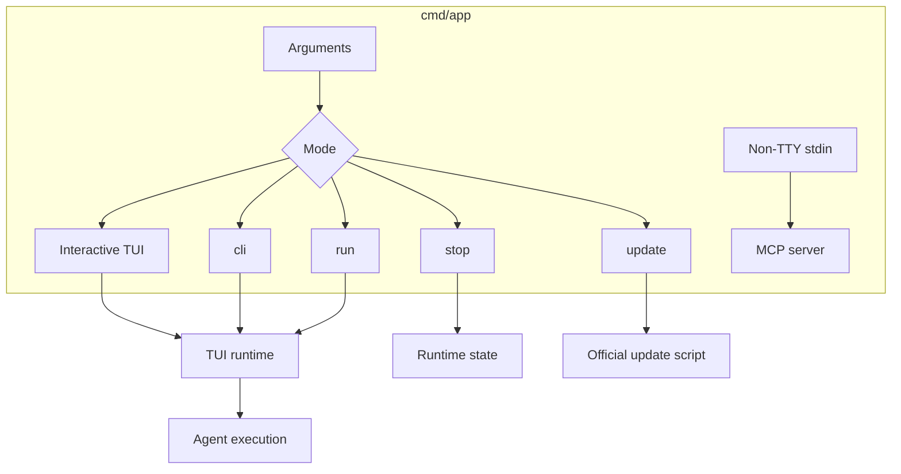

The runtime ships 10 model providers, plus the `compat` entry for local or custom OpenAI-compatible endpoints.

## Execution Modes

Agenvoy supports a process-local execution-mode toggle in the TUI. Press `Shift+F` while the input area is empty to switch between the default mode and fast mode; the header shows `[fast]` when enabled. The executor, dispatcher, summary, and related model calls pass the selected mode to `go-llm-router` v0.5.1. Supported provider backends can map `provider.ModeFast` to a faster service tier, while the default mode preserves normal provider behavior. The toggle is held in memory and is not persisted in `config.json`.

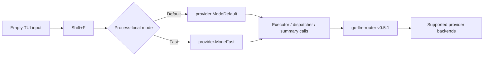

## Module: Daemon and HTTP API

The daemon initializes the filesystem, runtime limits, ToriiDB/history storage, registered tools, agents, schedulers, chatbots, and Gin routes. The HTTP API binds to `127.0.0.1` and covers two tiers: an agent-execution surface (send, chat completions, sessions, models, SSE logs, pending-task recovery) reachable without extra checks, and a much larger config/management surface — credentials, providers, MCP servers and their OAuth logins, rules, knowledge, schedule automation, the skill/tool allowlist, and read-only session-artifact/error-memory inspection — gated behind an additional `localhostOnly()` middleware since it touches credentials, config files, or process state. The web dashboard that drives the config tier lives in `page/`, is embedded into the binary at build time, and is served from `/` by the same daemon; `AGENVOY_PAGE_DIR` swaps the embedded copy for files on disk during development.

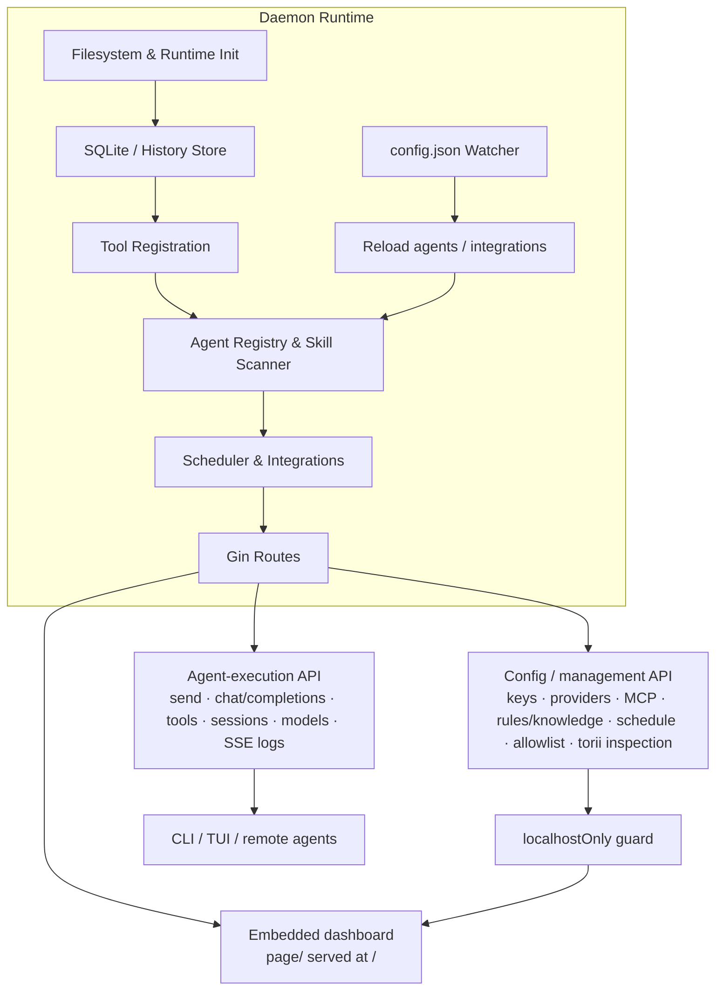

## Module: Agent Execution and Routing

A request is matched to a Skill or a configured model. The matched Skill description is passed to the selector as a task hint, while the request origin is propagated through execution and tool calls. The executor builds system prompts and a session, sends messages to the selected model, loops through tool calls, trims context when needed, and moves to fallback agents when a send attempt fails.

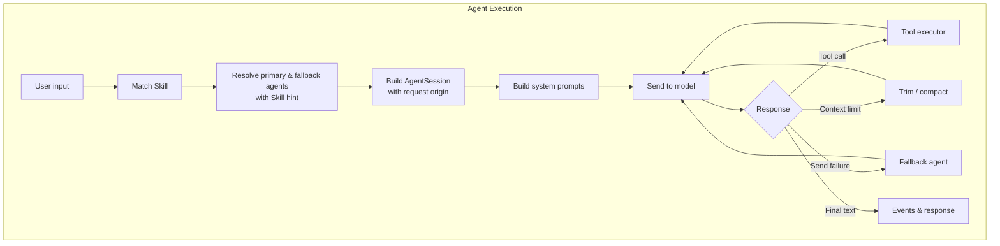

## Module: Tool Registry and Sandbox

Built-in tools and discovered API, script, extension, and MCP tools enter one registry (`internal/runtime/toolAdapter` plus `internal/runtime/mcp`). Fourteen tools ship with full schemas — `ask_user`, `calculate`, `chat_history`, `edit_file`, `fetch_page`, `find_files`, `find_knowledge`, `find_tools`, `read_files`, `reasoning_guide`, `run_command`, `run_skill`, `search_web`, `write_todo`; every other entry starts as a name and a description, and its parameters are injected on first use through `find_tools(mode=search)`. Before execution, file and command operations pass through allow rules, confirmation gates, shell validation, and sandbox enforcement. Paths outside `$HOME` and commands outside the allowlist are collected rather than refused: they raise a confirmation that also demands the operating-system password, and the grant is scoped to that session and that path or binary. A tool that carries a `mode` is gated by it: `list`/`read`/`search` are treated as read-only and skip confirmation, while `remove`/`restore` always confirm even on an otherwise auto-approved tool. Reasoning rules are fetched on demand through the single `reasoning_guide(topic=...)` tool.

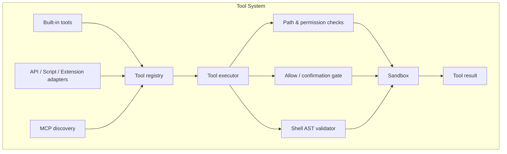

## Module: Sessions, History, and Pending Work

Sessions are identified by a prefix that also determines their origin: `cli-` for local CLI/TUI work, `tg-` for Telegram, `dc-` for Discord, `chat-` for web/API work, and `temp-` for short-lived work. The TUI session picker ranks these groups, places the current session first, and exposes `all` plus one tab per detected prefix when multiple groups exist. A daemon-side `fsnotify` watcher observes newly created session directories and logs the session ID and configured name.

Session configuration is persisted in the history SQLite database. Persona fields include a normalized lowercase `self_id`, limited to 32 ASCII letters, digits, `_`, and `-`; non-empty values are unique. The daemon migrates legacy `bot.json`, legacy bot markdown, session `config.json`, and `status.json` into SQLite/state tables during startup. New session creation persists the database row and creates the session directory before session logs are written.

## Module: Sessions, History, and Pending Work

Sessions persist configuration, model selection, message history, summaries, logs, usage, and pending interactive work. History appends deltas to `history.json` and mirrors searchable content to SQLite. Pending questions and confirmations retain their origin prefix; CLI, web, Telegram, and Discord listeners consume only matching work before resuming through the registered handler.

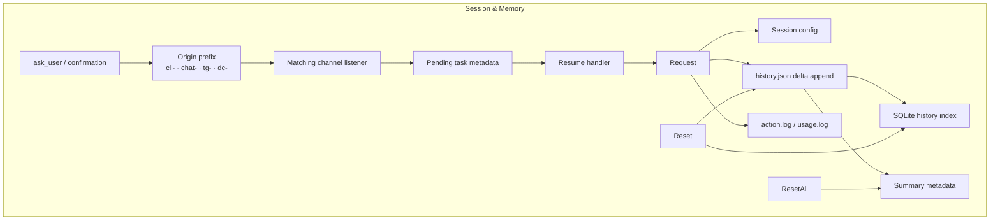

## Module: Runtime Monitoring

The daemon starts a background monitor that samples every 30 seconds. It reports high CPU usage at or above 80%, Go process memory at or above 2 GiB, and loss of TCP connectivity to `1.1.1.1:443`; recovery events are logged when each condition clears. When CPU is high, the monitor also queries the top three processes with `ps` when available. These records are emitted through the daemon log stream and are independent of agent session execution.

## Module: Task Lifecycle, Concurrency, and Cancellation

Every execution registers itself in `status.json` — and registers its cancel function — _before_ competing for a per-session concurrency slot, so a task queued behind the limit stays observable and cancellable instead of blocking invisibly. Each task records the PID of the process running it; any reader that finds a task whose PID is no longer alive treats it as stale and clears it, so a killed or crashed process cannot leave a session permanently marked online.

Concurrency is per session (`MaxSessionTasks`, defaulting to four times the CPU count). Sessions never block or cancel one another, and exceeding the limit queues a task rather than rejecting it.

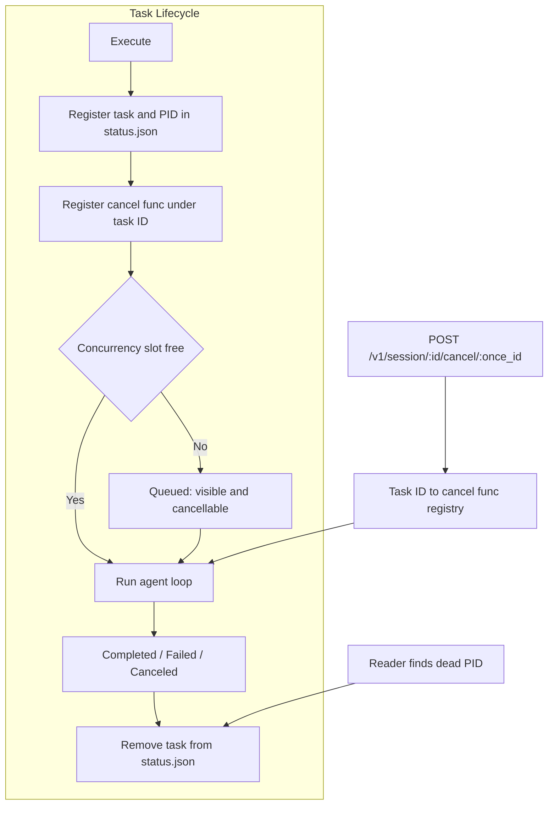

## Module: Chat and MCP Integrations

Telegram and Discord use a shared event pipeline with channel-specific authorization, attachment handling, origin-matched pending confirmations, formatting, and push delivery. Web result, SSE, pending, and multilog handlers preserve file-delivery markers through transport; the dashboard strips them only when rendering visible text. External MCP servers are consumed through stdio or streamable HTTP via the official `modelcontextprotocol/go-sdk` client in `internal/runtime/mcp`; tool-list change notifications trigger re-registration, and server instructions are injected into the agent system prompt. HTTP servers marked `auth: oauth` authorize through `mcp.Login`: the daemon opens a loopback callback listener on `localhost:17988`, performs dynamic client registration when the provider allows it, and stores the resulting token and client id in the OS keychain. A pre-registered client can be supplied instead, and the redirect URL can be pasted back when the browser cannot reach the listener. Agenvoy can also expose local tools as a stdin JSON-RPC MCP server (`mcp.NewServer()`).

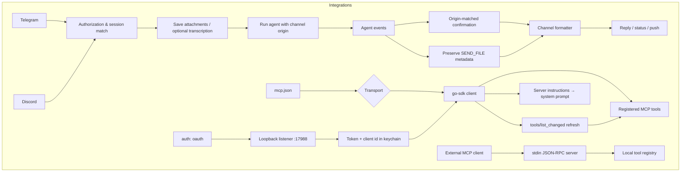

## Data Flow

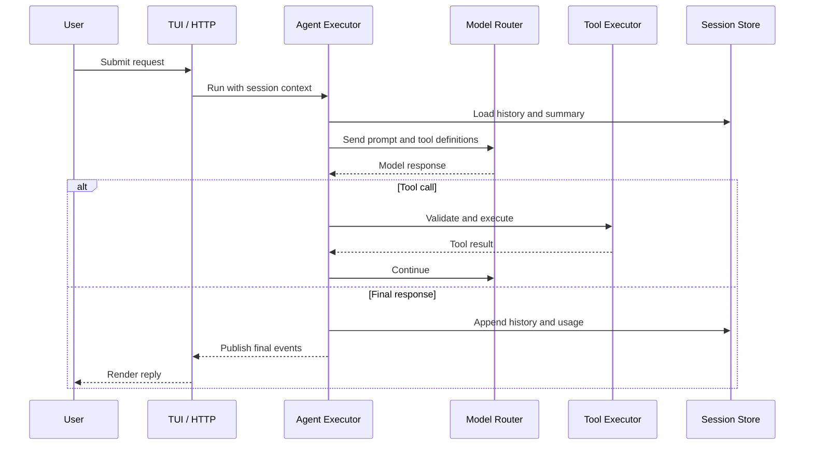

## State Machine

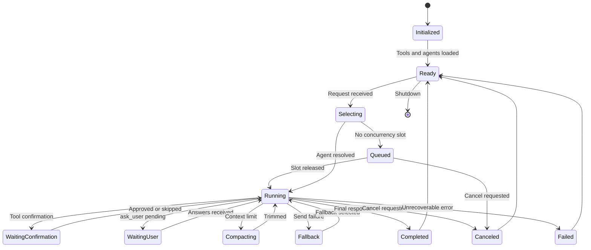

## Security Boundaries

- The HTTP daemon binds to `127.0.0.1`; selected endpoints apply an additional localhost-only guard.
- File operations resolve through `boundary.Resolve`, which applies denied-path and sensitive-file checks before execution.
- Command execution is subject to allow rules, AST-based shell validation, and OS-level sandbox policies (`sandbox-exec` on macOS, `bwrap` on Linux).
- Restricted paths and non-allowlisted commands are not refused outright: they raise a confirmation that also requires the operating-system password, and the grant is bound to that session plus that specific path or binary. Channels that cannot collect a password — HTTP API, chat bots, subagents — receive the call back as skipped. There is no elevated or `/sudo` mode; per-request authorization replaced it.
- `$HOME` is always writable, no setup needed. To write outside it the agent attaches `write_paths` to that call; the paths are bound in only after you approve the prompt with your system password.
- `run` mode bypasses confirmation only for its request; sandbox and denied-path protections still apply.
- Credentials are stored through the operating-system keychain integration, not in the repository.

## Persistence Layout

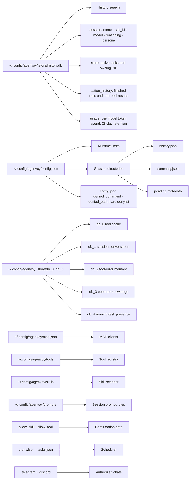

---

©️ 2026 [邱敬幃 Pardn Chiu](https://www.linkedin.com/in/pardnchiu)
