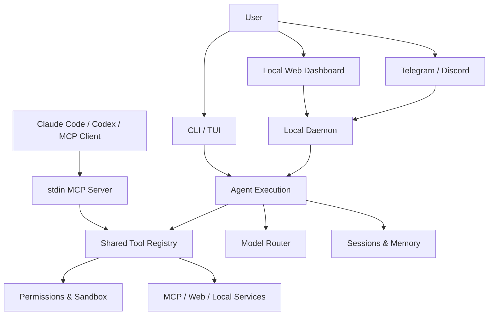
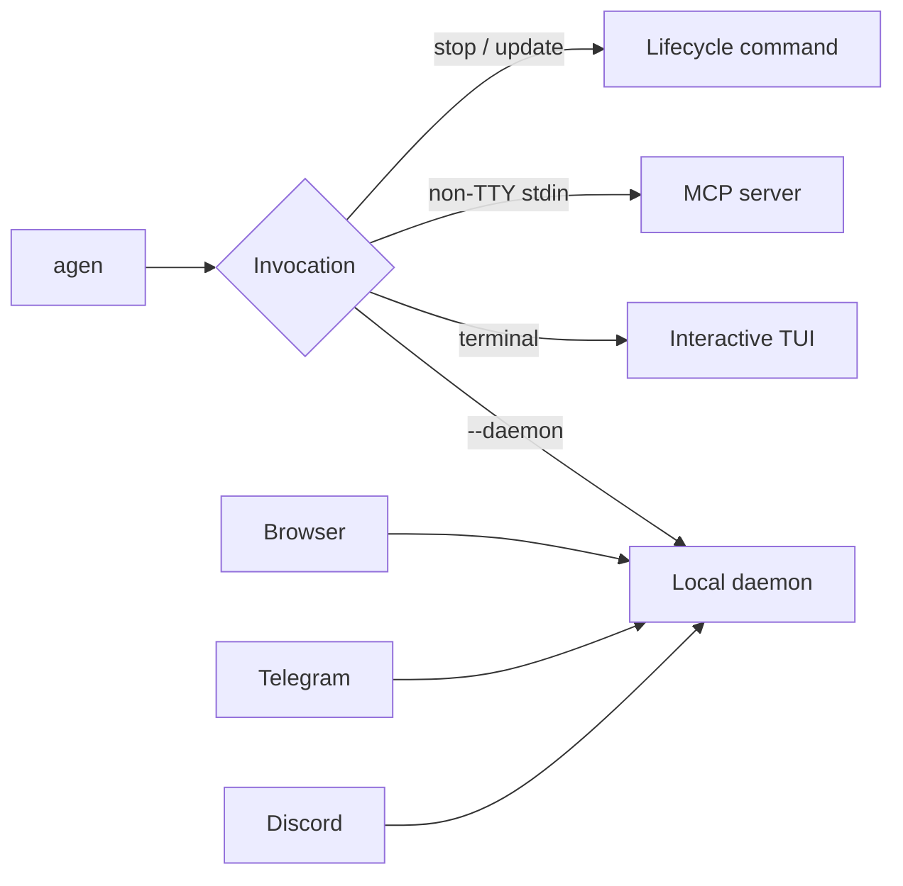
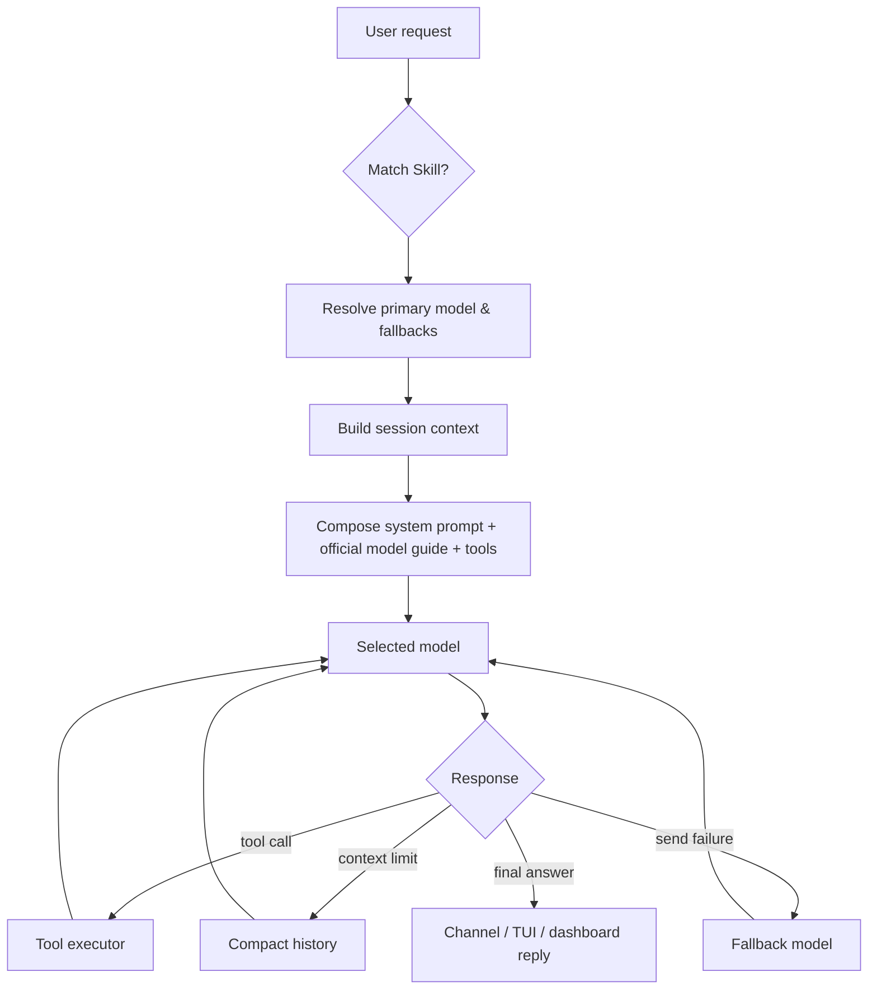
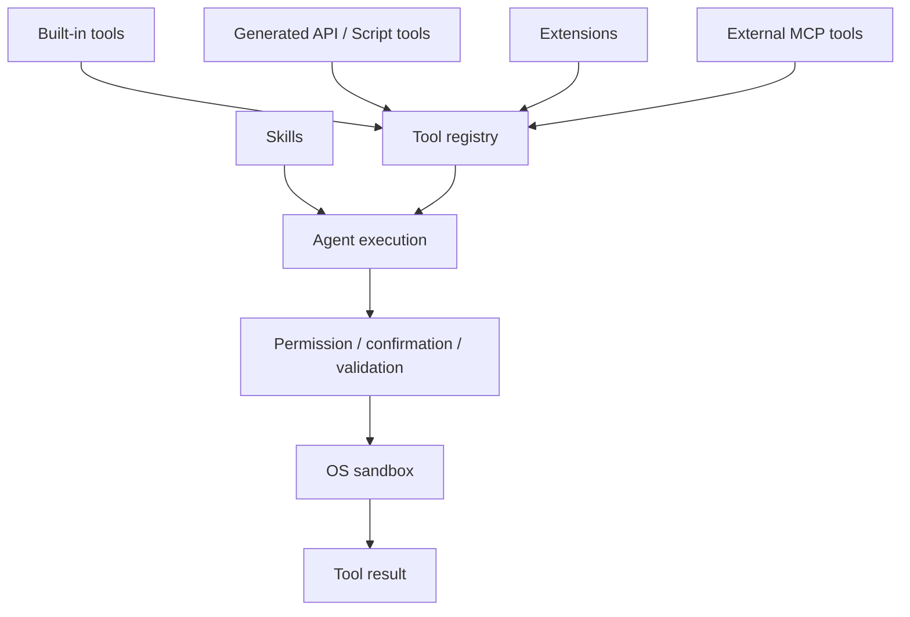
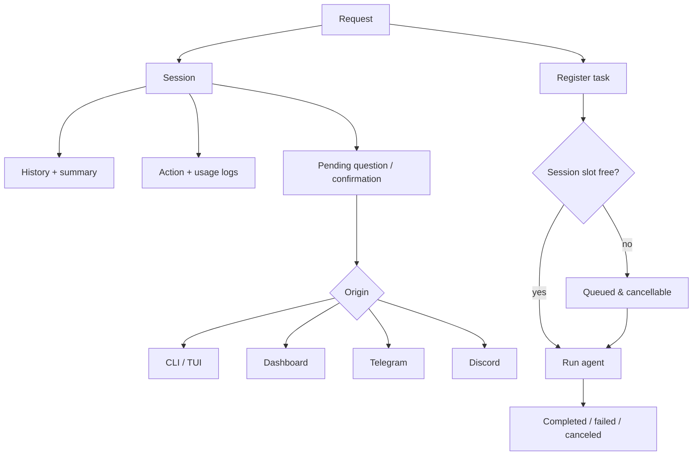
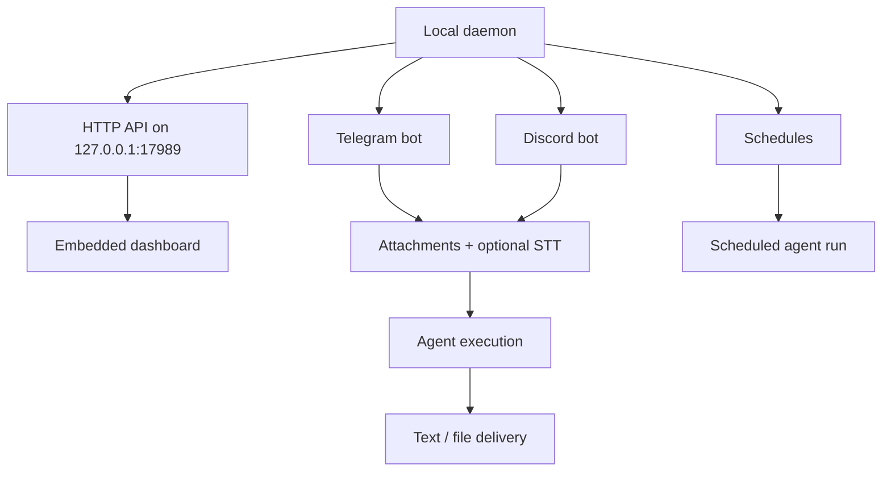
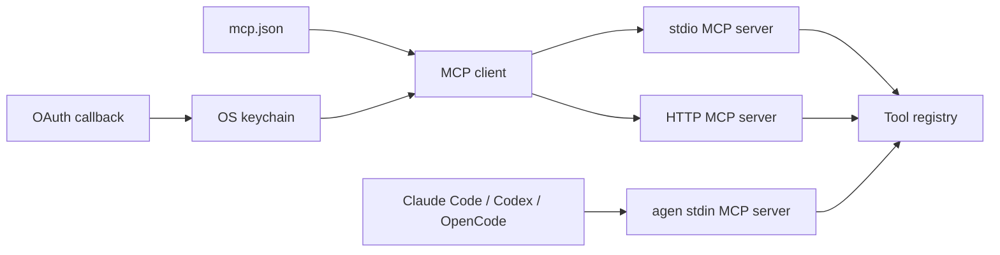
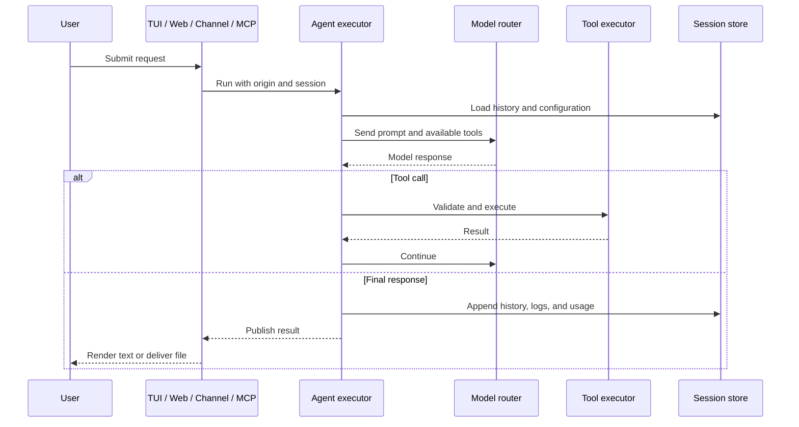
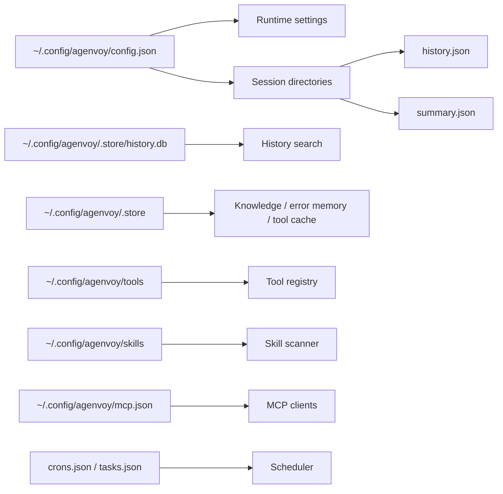

# Agenvoy - Architecture

> Back to [README](../README.md)

## Overview

Agenvoy is a local Go agent runtime. One execution engine powers the interactive TUI, browser dashboard, Telegram and Discord, and the stdin MCP server. It routes each request to a configured model, runs Skills and sandboxed tools, persists session history, and can create tools when a capability is missing.

## Module: Entry Points

The `agen` binary opens the TUI by default. The local daemon serves the browser dashboard at `http://127.0.0.1:17989`; Telegram and Discord connect outward from that daemon, so no inbound port or public host is required. When stdin is not a terminal, `agen` serves local tools through newline-delimited JSON-RPC MCP instead of opening the TUI.

## Module: Agent Execution and Model Routing

The runtime matches a request to a Skill when applicable, then uses the Skill description and task text to select the primary model and fallbacks. It separately configures the dispatcher, summary, image generation, speech-to-text (STT), and text-to-speech (TTS) roles. During prompt assembly it injects the common official operating guide plus any guide matching the selected model. This enables task-aware model routing instead of one model handling every operation. For multi-provider setups, `gpt-oss-20b` through NVIDIA NIM can optionally act as a fast dispatcher.

## Module: Tools, Skills, and Sandbox

Built-in tools, generated API/script tools, installed extensions, and MCP tools share one registry. Tools load their full schema only when needed to keep routine requests lightweight. Before execution, filesystem and command actions pass permission checks, confirmation gates, shell validation, and OS-level sandbox rules. If live data needs a tool that does not exist, the agent can build, test, and retain a new tool.

## Module: Sessions, Memory, and Task Lifecycle

Every request belongs to a session. Sessions retain configuration, model choices, messages, summaries, logs, usage, and pending questions. Origin prefixes keep interactive work with the correct listener: local CLI/TUI, web, Telegram, and Discord each resume only their own pending request. Tasks are registered before they compete for a per-session concurrency slot, so queued work remains visible and cancellable.

## Module: Daemon, Dashboard, and Chat Channels

The daemon initializes storage, tools, agents, schedules, chat channels, and the local HTTP API. Its dashboard is embedded in the binary and served by the same localhost-only daemon. Telegram and Discord require only their bot tokens because the daemon initiates the connection. Since **v0.34.4**, the default voice-input-to-voice-output loop is paused for those channels; STT/TTS tools can still generate audio files and send them through either channel.

## Module: MCP Client and Server

Agenvoy connects to external MCP servers over stdio or streamable HTTP, refreshes their tools when their catalog changes, and can complete OAuth sign-in while storing credentials in the operating-system keychain. In the other direction, running `agen` with non-terminal stdin exposes the same sandboxed local tools to Claude Code, Codex, OpenCode, and other MCP-compatible clients.

## Data Flow

## Security Boundaries

- The dashboard and management API bind to `127.0.0.1`; the host is not exposed for normal browser or chatbot use.
- Telegram and Discord use outbound connections from the local daemon and need only a bot token.
- File writes outside `$HOME` and non-allowlisted commands require explicit confirmation; approval is scoped to the session and requested path or binary.
- Command execution is validated and sandboxed (`sandbox-exec` on macOS and `bwrap` on Linux).
- Credentials, including provider and MCP OAuth tokens, are stored in the operating-system keychain rather than the repository.

## Persistence Layout

---

©️ 2026 [邱敬幃 Pardn Chiu](https://www.linkedin.com/in/pardnchiu)
