# Agenvoy - 架構

> 返回 [README](./README.zh.md)

## 概覽

Agenvoy 是以 Go 撰寫的本機 Agent 執行環境，整合互動式終端介面、本機 HTTP daemon、聊天機器人整合，以及 MCP client／server 功能。所有進入路徑共用模型路由、session-aware 工具、Skill 與持久化歷史的同一執行引擎。

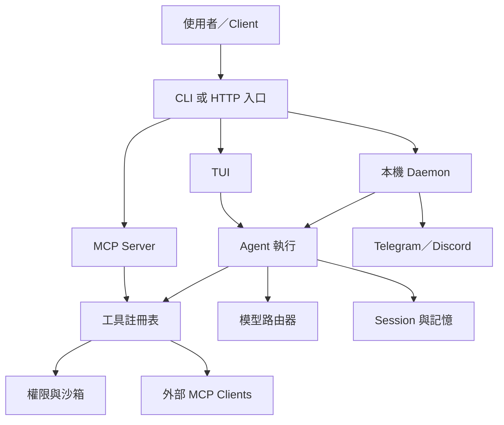

## 模組：進入點

`cmd/app` 二進位檔預設啟動 TUI。`agen cli <input>` 保留逐次工具確認，`agen run <input>` 則只在該次執行中允許工具自動執行，仍受沙箱政策限制。`agen stop` 停止 daemon，`agen update` 執行官方更新器，而非終端 stdin 會啟動 MCP server。

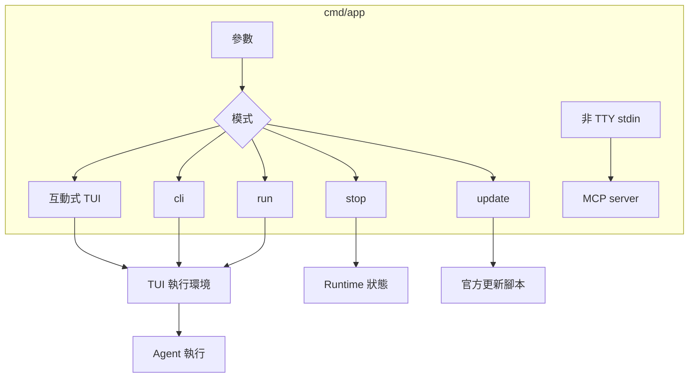

## 執行模式

Agenvoy 支援在 TUI 中切換只存在於目前行程的執行模式。當輸入區為空時按下 `Shift+F`，即可在預設模式與 fast mode 之間切換；啟用時標題列會顯示 `[fast]`。執行器、dispatcher、summary 與相關模型呼叫會將選定模式傳給 `go-llm-router` v0.4.0。支援的 provider backend 可將 `provider.ModeFast` 對應到更快速的服務層級；預設模式則維持一般 provider 行為。此切換狀態只保存在記憶體中，不會寫入 `config.json`。

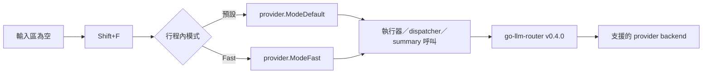

## 圖像生成邊界

圖像生成目前暫時不可用，等待 router 整合重新設計。原有的 `image2` 指令、`enable_image2` 設定旗標、`generate_image` 工具與註冊路徑已不再屬於 runtime；若需要圖像輸出，請使用外部整合。

## 模組：Daemon 與 HTTP API

Daemon 初始化檔案系統、runtime limits、ToriiDB／history 儲存、已註冊工具、Agent、排程器、聊天整合與 Gin routes。HTTP API 僅綁定 `127.0.0.1`，分兩層：不需額外檢查即可用的 Agent 執行層（send、chat completions、工具呼叫、session、模型、SSE log、pending task 恢復），以及規模大得多的設定／管理層——憑證、provider、MCP server、cron/task 自動化、KuraDB 生命週期、指令／skill 白名單、以及唯讀的 session artifact／error memory 查閱——這層額外掛上 `localhostOnly()` middleware，因為會動到憑證、設定檔或行程狀態。設定層的預期用戶端是一個獨立托管的 web dashboard（不在本 repo 內）。

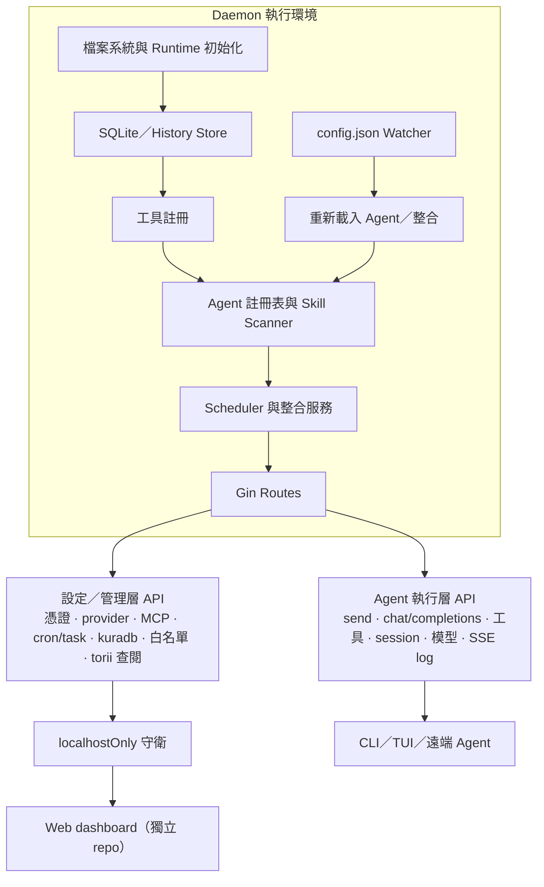

## 模組：Agent 執行與路由

請求會比對至 Skill 或已設定模型。執行器建立 system prompt 與 session，將訊息傳給選定模型，迭代處理工具呼叫；需要時裁剪 context，若傳送失敗則轉移至 fallback Agent。

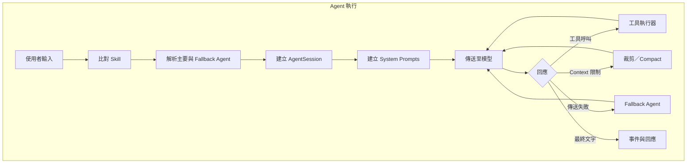

## 模組：工具註冊表與沙箱

內建工具與探索到的 API、script、extension、MCP 工具都進入同一註冊表（`internal/runtime/toolAdapter` 與 `internal/runtime/mcp`）。檔案與命令操作在執行前會通過 denied path、allow rule、確認閘門、shell 驗證與 sandbox enforcement。推理規則透過單一 `reasoning_guide(topic=...)` 工具按需取得。

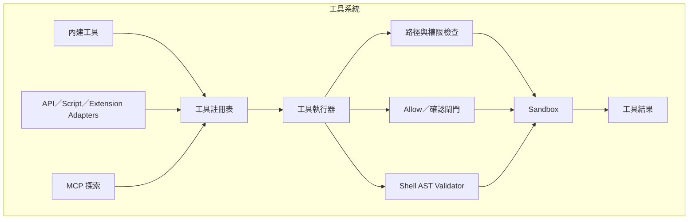

## 模組：Session、歷史與 Pending 工作

Session 持久保存設定、模型選擇、訊息歷史、摘要、log、usage 與互動中的 pending 工作。History 會以 delta 方式追加到 `history.json`，並同步可搜尋內容至 SQLite。待回答問題會保留 task metadata，並透過已註冊的 channel handler 恢復。

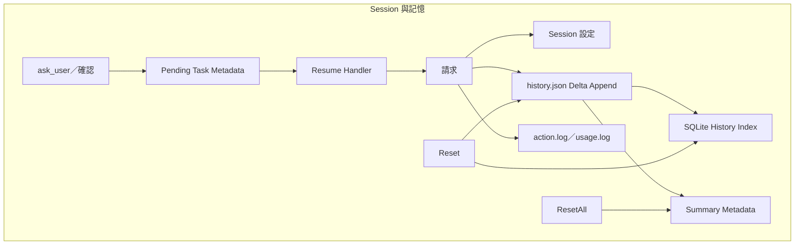

## 模組：任務生命週期、併發與取消

每次執行都會**先**把任務登記進 `status.json`、並登記自己的取消函式，**才**去競爭該 session 的併發名額，因此被上限擋住而排隊中的任務依然看得到、也取消得掉，不會無聲卡住。每筆任務都記錄執行它的行程 PID；任何讀取端只要發現某筆任務的 PID 已不存在，就視為 stale 並清除——被砍掉或崩潰的行程因此無法讓 session 永久停留在 online 狀態。

併發上限是 per session（`MaxSessionTasks`，預設為 CPU 數量的四倍）。不同 session 之間不會互相阻塞或取消，超過上限的任務是排隊等待，而不是被拒絕。

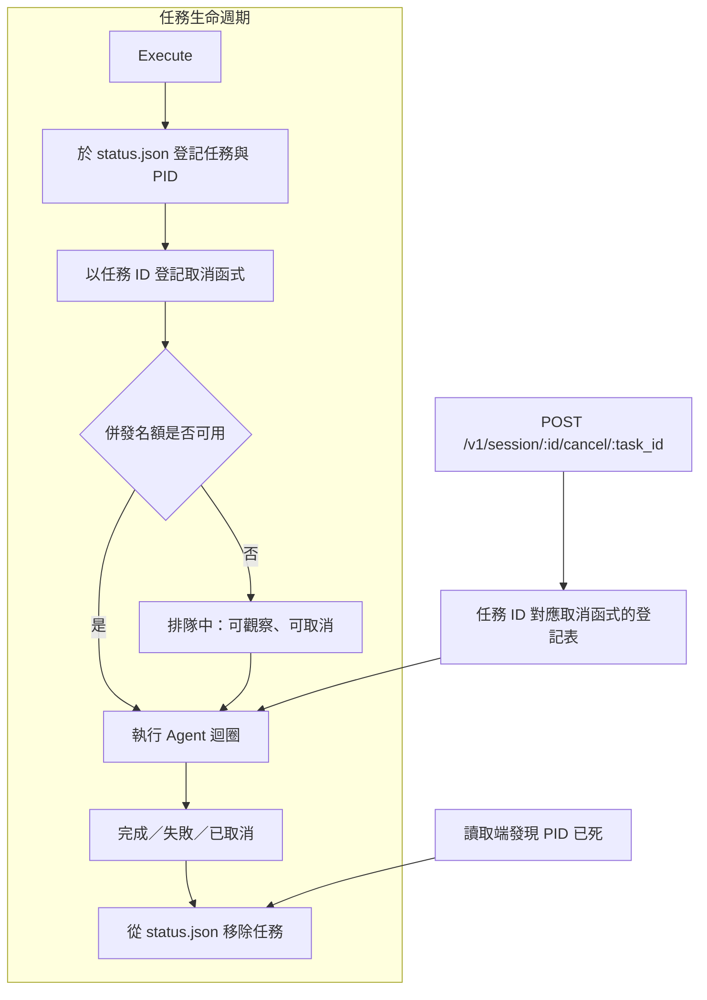

## 模組：聊天與 MCP 整合

Telegram 與 Discord 採用共用 event pipeline，但保有頻道專屬的授權、附件處理、pending confirmation、格式化與 push delivery。外部 MCP server 經 `internal/runtime/mcp` 內的官方 `modelcontextprotocol/go-sdk` client，以 stdio 或 streamable HTTP 連線；工具清單變更通知會觸發重新註冊，server instructions 會注入 agent system prompt。Agenvoy 也能以 stdin JSON-RPC MCP server（`mcp.NewServer()`）暴露本機工具。

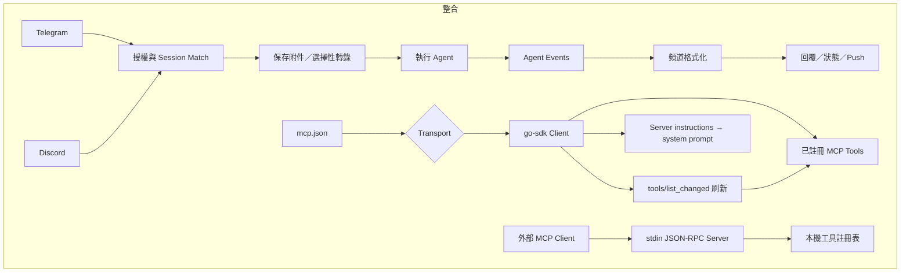

## 資料流

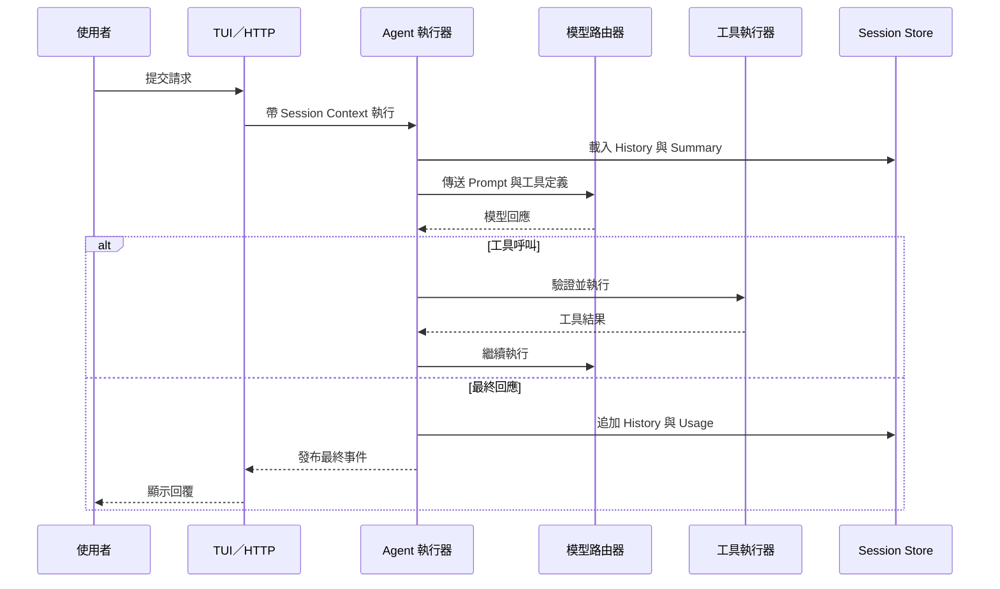

## 狀態機

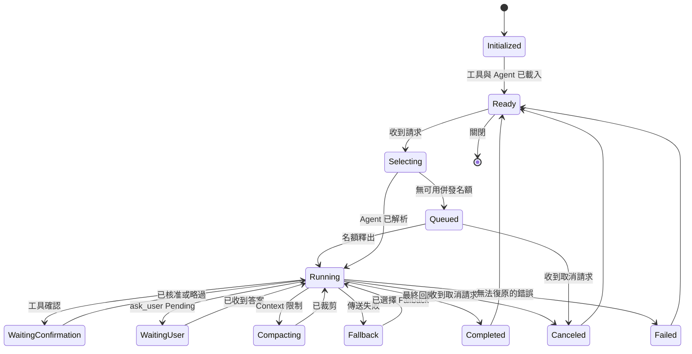

## 安全邊界

- HTTP daemon 綁定 `127.0.0.1`；部分 endpoint 另有 localhost-only guard。
- 檔案操作在執行前使用 denied path 與 sensitive-file 檢查。
- 命令執行受 allow rule、AST-based shell validation 與 sandbox policy 限制。
- `run` 模式只略過該次 request 的確認，不會略過 sandbox 與 denied-path 保護。
- 憑證透過作業系統 keychain integration 保存，不放在 repository 中。

## 持久化結構

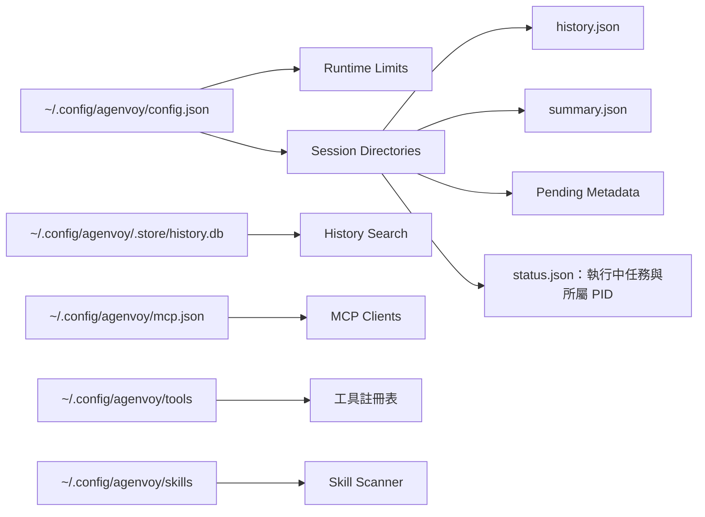

***

©️ 2026 [邱敬幃 Pardn Chiu](https://www.linkedin.com/in/pardnchiu)
