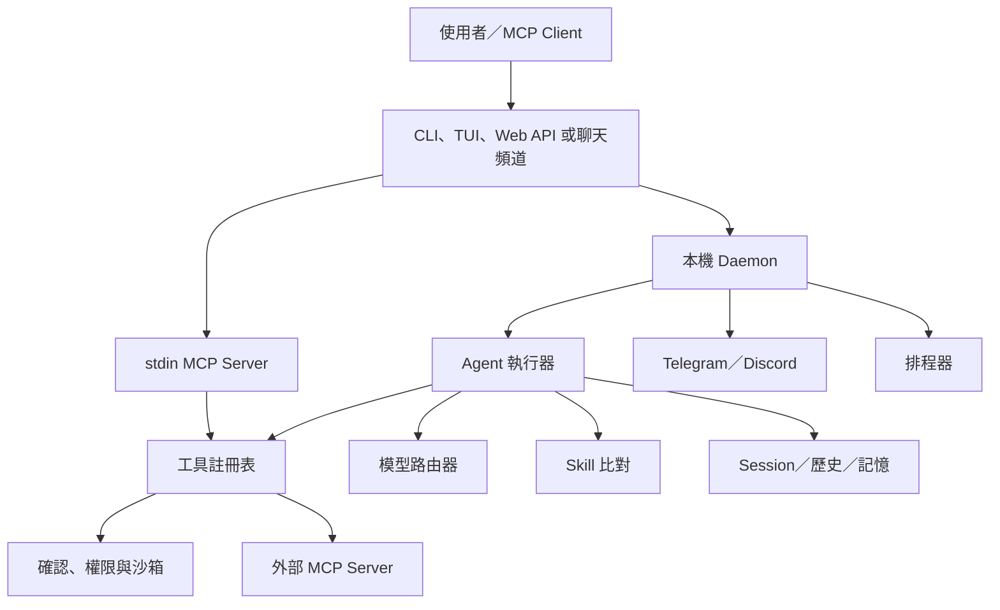
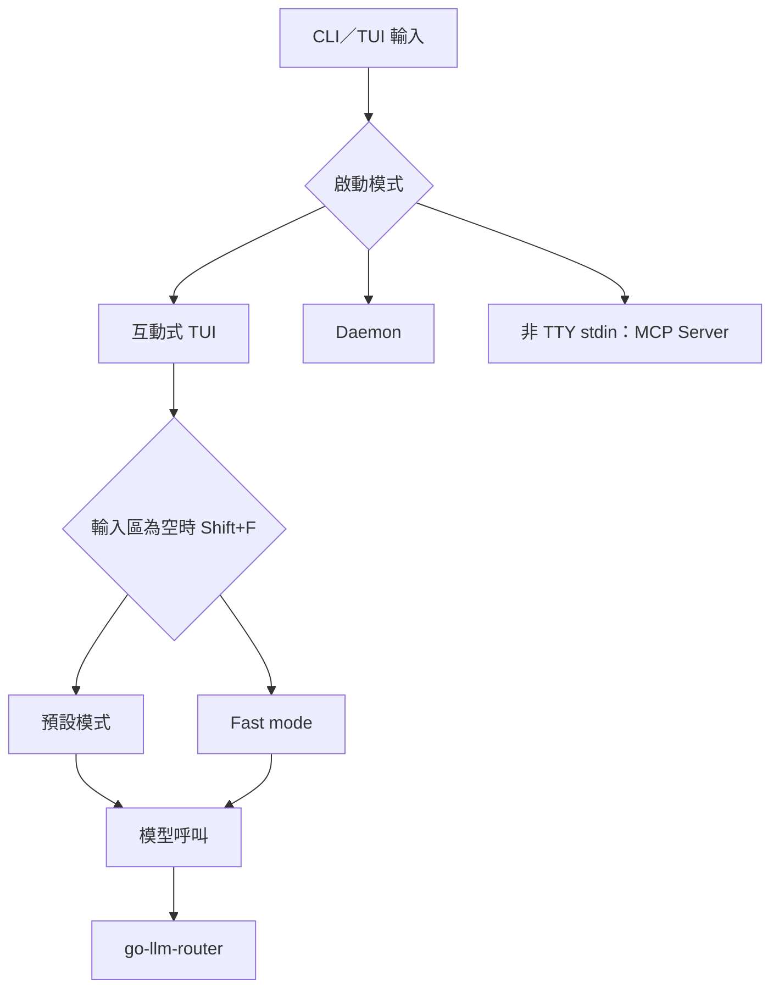
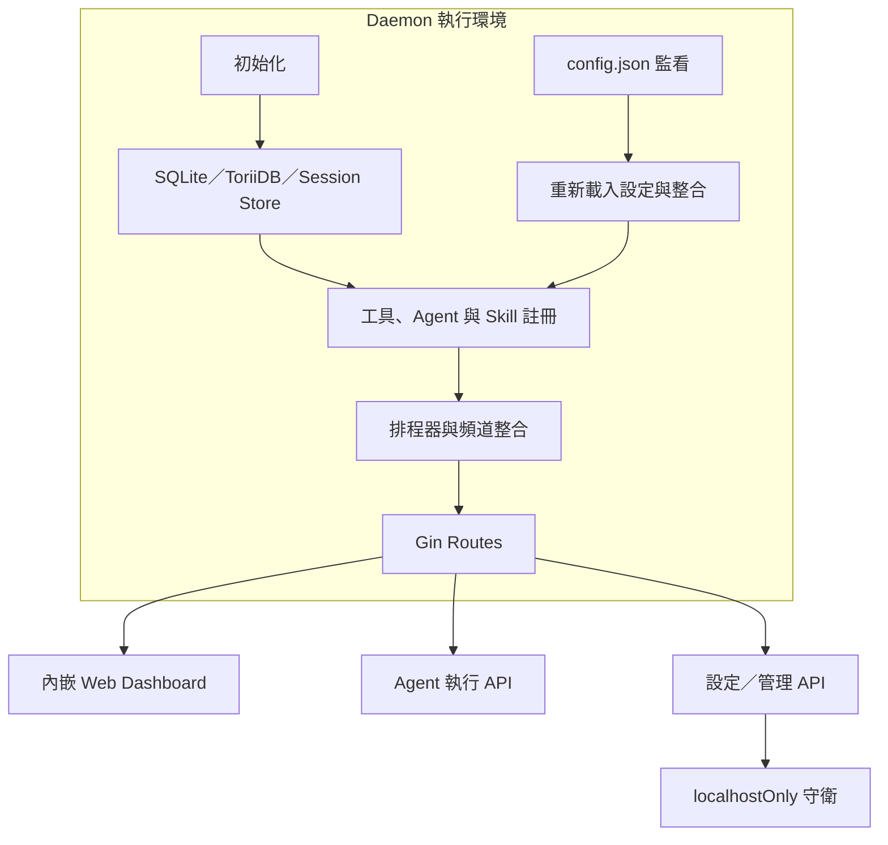
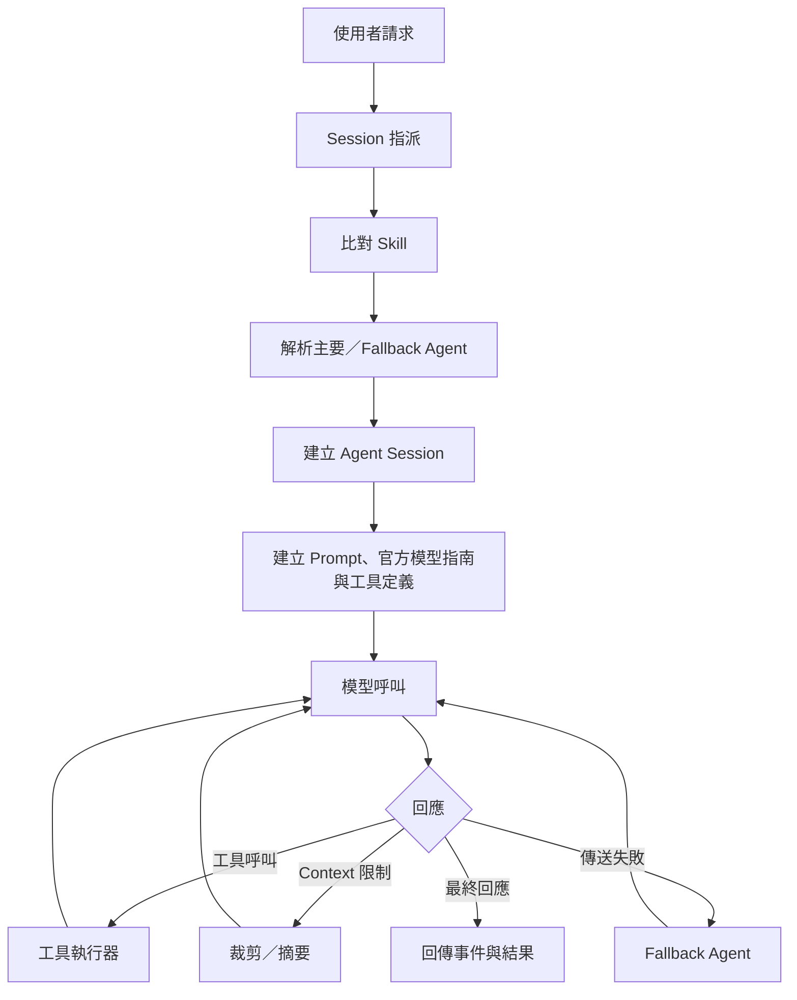
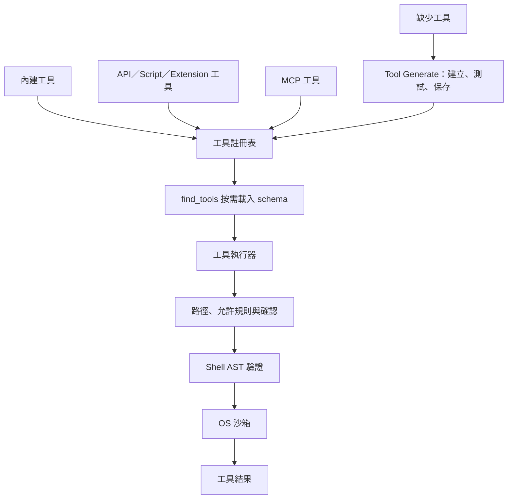
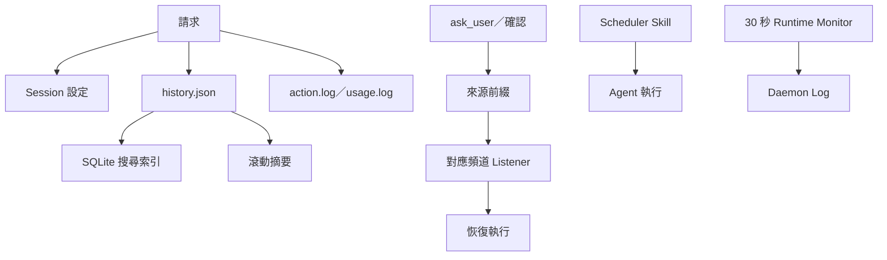
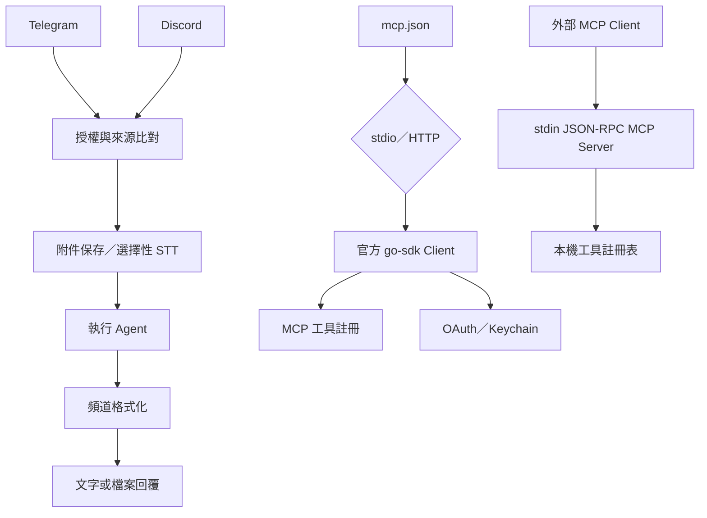
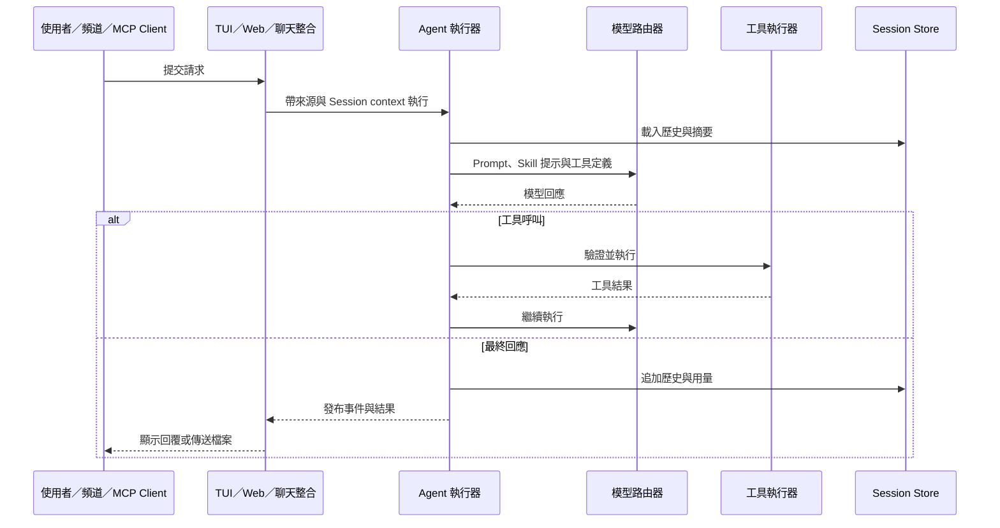
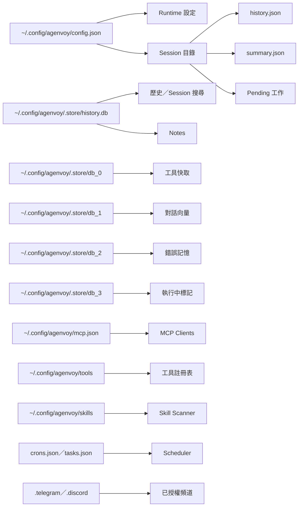

# Agenvoy - 架構

> 返回 [README](./README.zh.md)

## 概覽

Agenvoy 是以 Go 撰寫、在個人電腦上執行的本機 Agent 執行環境。它把 TUI、Web 儀表板、本機 HTTP API、Telegram／Discord 與 MCP client／server 整合到同一個執行引擎；Agent 可依 Skill 與任務路由模型、呼叫沙箱工具，並將 session、排程、筆記與歷史保留在本機。

## 模組：進入點與執行模式

`cmd/app` 預設開啟 TUI；`agen stop` 停止 daemon，`agen update` 執行官方更新器，stdin 非 TTY 時則改為 stdio JSON-RPC MCP server。Web 儀表板由 daemon 提供於 `http://127.0.0.1:17989`。

輸入區為空時可按 `Shift+F` 切換只存在於目前行程的 fast mode；執行器、dispatcher 與 summary 呼叫會把模式傳給 `go-llm-router`。Runtime 支援多個模型 provider 與 `compat` 的 OpenAI 相容端點，並可獨立設定 dispatcher、summary、圖片生成、STT 與 TTS。多 provider 的配置可選擇以 NVIDIA NIM 的 `gpt-oss-20b` 作為 dispatcher，取得智慧路由與快速回應。

## 模組：Daemon、Web 與 HTTP API

Daemon 初始化檔案系統、設定、ToriiDB、SQLite 歷史儲存、工具、Agent、Skill scanner、排程與聊天頻道；啟動時會清除過期的執行中標記，完成筆記遷移後才提供本機 HTTP API。Dashboard 嵌入二進位檔後由 `/` 提供。HTTP API 綁定 `127.0.0.1`；Agent 執行、session、模型與 SSE log 可由一般 API surface 使用，而憑證、provider、MCP、規則、筆記、排程與白名單等設定／管理操作另受 `localhostOnly()` 保護。

## 模組：Agent 執行、Skill 與模型路由

每個請求先檢查 session 指派與 Skill；Skill 描述會成為 dispatcher 的任務提示。執行器建立帶有來源、附件與 session context 的 prompt，依所選模型加入共用官方操作指南與相符的模型專屬指南，選定主要 Agent 後迭代執行模型回應與工具呼叫。context 超限時會 compact，模型傳送失敗時會使用 fallback Agent。圖片生成、STT 與 TTS 是可各自設定的模型路由能力。

## 模組：工具註冊表與沙箱

內建工具、API／script／extension 工具及外部 MCP 工具都進入同一份註冊表。檔案工具也提供 `write_report`，將長篇報告寫入工作目錄；缺少即時資料工具時，Agent 可依 Tool Generate 流程建立、測試並保留新工具。Web Search、檔案搜尋與 RAG 則可直接提供即時或本機資料。檔案與命令操作都需經過 denied path、敏感路徑、確認閘門、套件名稱或 shell 驗證及作業系統沙箱。命令政策採 denylist：命中使用者設定的拒絕清單即硬拒，其他命令仍可能進入一般確認流程。

## 模組：Session、歷史、排程與監控

Session ID 前綴代表來源：`cli-`、`chat-`、`tg-`、`dc-` 與 `temp-`。Session 設定存於 SQLite；訊息、摘要、使用量、log 與 pending 工作依 session 保存。執行中的工作會在 ToriiDB 寫入短效 `action:<session>:<task>` 標記並定期刷新，因此 pending 清單只會顯示可恢復的工作。排程器可執行週期或單次的 scheduler skill。

## 模組：聊天頻道與 MCP 整合

Telegram 與 Discord 由本機 daemon 主動連線，因此不需開放入站連接埠或公開主機；設定只需要對應 bot token。兩個頻道都支援附件保存與選擇性 STT 轉錄、依來源配對的確認、格式化回覆及音訊檔傳送。自 **v0.34.4** 起，暫停「收到語音輸入後自動產生並回傳語音輸出」的預設流程；本機仍可使用 STT／TTS 生成音訊並將檔案傳送到頻道。

外部 MCP server 可經 stdio 或 streamable HTTP 連接；工具清單變更時會重新註冊工具，server instructions 會加入 Agent system prompt。HTTP MCP server 可走 OAuth，token 與 client id 會存於作業系統 keychain。Agenvoy 本身也能以 stdin JSON-RPC MCP server 將本機沙箱工具提供給 Claude Code、Codex、OpenCode 與其他 MCP Client。

## 資料流

## 安全邊界

- Daemon 綁定 `127.0.0.1`；設定與管理 endpoint 另有 localhost-only 守衛。
- denied path 與 denied command 會直接拒絕；敏感路徑、`$HOME` 外寫入及其他受限操作則要求明確確認，支援時再要求系統驗證。
- 命令執行受 shell AST validation 及 OS 沙箱限制（macOS 的 `sandbox-exec`、Linux 的 `bwrap`）。
- 憑證與 OAuth token 存在作業系統 keychain，不寫入 repository。

## 持久化結構

---

©️ 2026 [邱敬幃 Pardn Chiu](https://www.linkedin.com/in/pardnchiu)